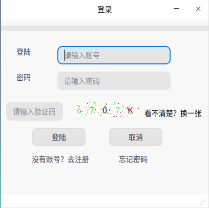

### gin_mall_qt

gin_mall_qt是一款基于qt框架的电子商城前端，[电子商城后端gin_mall](https://github.com/CocaineCong/gin-mall)使用go语言基于gin框架实现。

# 说明

```bash
qmake .

make -j2

./gin_mall_qt_client
```

备注：由于源码中的资源图片暂未加到qrc，在构建前请手动修改源码中以绝对路径配置的资源图片。

代码当前处于调试练手阶段，代码风格\内存检测还未处理，欢迎不不吝赐教，积极提交pr，不喜勿喷，谢谢合作．．．

# 项目需要完善的地方

1. 界面全球化。---做了一部分
2. 购物车\主页面\个人中心\我的订单\收货地址管理\搜索．．．
3. 部分已实现页面的布局美化
4. 代码扫描(内存检测)．．．

# 部分已实现页面展示

登陆



注册


账号修改


主页


商品详情


购物车


关于


# 全球化

1. 使用lupdate生成ts文件

```bash
lupdate gin_mall_qt.pro -ts translations/i18n_zh_cn.ts
```

2. 使用Qt Linguists打开并编辑生成的ts文件
3. 使用lrelease生成qm文件

```bash
lrelease translations/i18n_zh_cn.ts -qm translations/i18n_zh_cn.qm　
```

    4.使用Qt Creator添加一个qrc文件，包含要使用的语言资源文件

# 参考

https://www.jianshu.com/p/71f738364410

https://www.cnblogs.com/oloroso/p/4596740.html

https://blog.csdn.net/maizousidemao/article/details/127033800?ydreferer=aHR0cHM6Ly93d3cuZ29vZ2xlLmNvbS5oay8%3D

https://zhuanlan.zhihu.com/p/603853479

https://github.com/MovingPig/CarouselImageWindow

https://github.com/congz666/cmall-vue

## License

This project is licensed under [GPLv3](LICENSE) or any later version.
